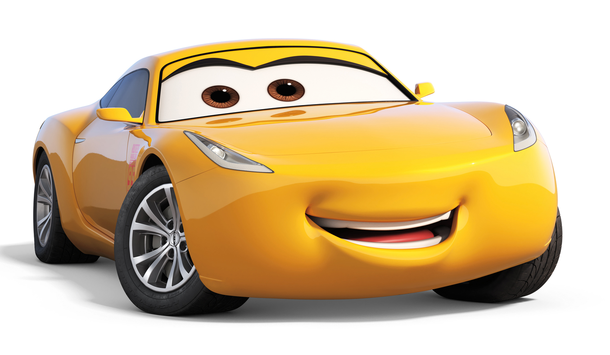
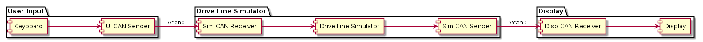

# Ramirez Car Simulator Project

This C++ learning project aims to create a simple and very incomplete simulation of a car. It is split into three modules: The user input, the driveline simulation, and the driver display. The three modules communicate over a common virtual CAN bus.

The first two modules are developed from scratch by the Team Ramirez, while the display module was pre-coded by Rashid Zamani with appropriate API.

## User Input

The user can input instructions to the simulation via the keyboard. These instructions are:

Key | Input
:-- | --:
s | Toggle ignition
0..9 | 0..90% throttle
f | Full throttle
p | Park
r | Reverse
n | Neutral
d | Drive
j | Left Blinker
l | Right Blinker
k | Hazard ON
i | Blinkers OFF
t | Seatbelt 
y | Doors
u | Highbeams
q | Quit

### Quitting

When 'q' is pressed by the user the UI module will send out a number of CAN frames with ID 0x0CC before shutting down. These frames will trigger the other two modules to shut down, making shut down of all modules quick and easy.

### UI CAN Sender

The UI module has a thread running a CAN sender independently. It will send CAN frames with ID 0x0AA every 100 ms on the 'vcan0' virtual CAN bus. Each frame carries a 4 bit frame counter and of course the latest user input data.

## Drive Line Simulator

The drive line simulator calculates speed and RPM etc. It has no public interface. Using mutex locks, it takes input from shared data with its CAN receiver, and produces output data witch is shared with its CAN sender.

Each gear will drive a limited range of speed based on throtle.

Requested Throtle | Gear     | speed upr  | speed lwr thr |
| :---            | :---:    |    :----:  |         :---: |
|0                | Gear 0   | 0          | 0             |
|0 ~ 20           | Gear 1   | 0          | 20            |
|20 ~ 40           | Gear 2   | 20         | 50            |
|40 ~ 60           | Gear 3   | 50         | 80            |
|60 ~ 80           | Gear 4   | 80         | 150           |
|80 ~ 100           | Gear 5   | 150        | 180           |

### Simulator CAN Sender and Receiver

The simulator has two independent threads running a CAN receiver and sender respectively. The receiver listens for any frame with ID 0x0AA or 0x0CC, and when received it updates the shared input data accordingly.

The CAN sender sends frames with ID 0x0BB every 100 ms on the virtual 'vcan0' bus. Each frame has a 4 bit counter and the latest available shared output data.

## Display

The display module controls what the driver sees in the instrument cluster. It updates the gauges and icon lights according to the received data from the simulator.

### Display CAN Receiver

The display's CAN receiver listens for any frame with ID 0x0BB or 0x0CC and passes the data of 0x0BB frames to the function that updates the instrument cluster.

## Testing

Performs GoogleTest on the DriveLine unit.

## Repository

[Engine Emulator](https://github.com/muncausen/BootCampMidTermLab/tree/main/Emulator).
